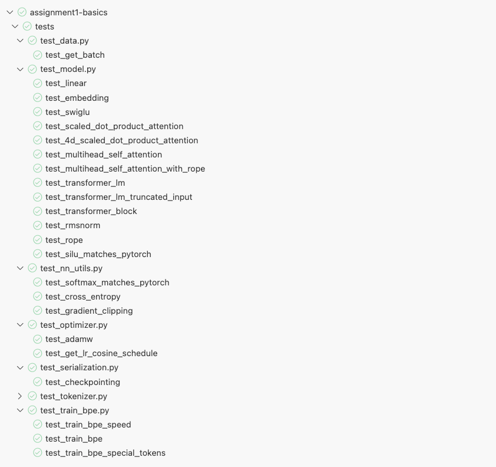
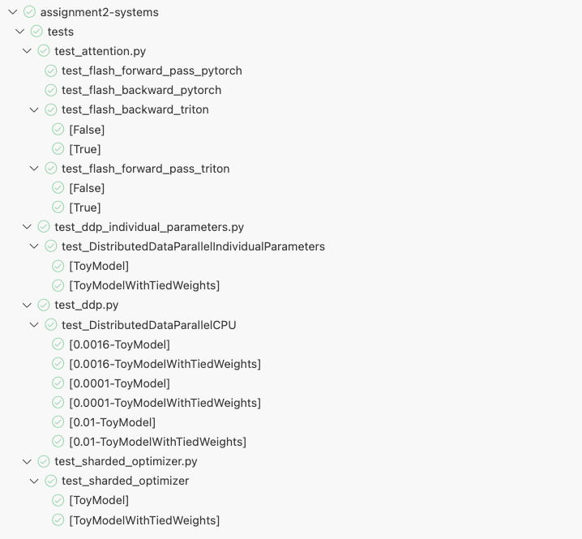
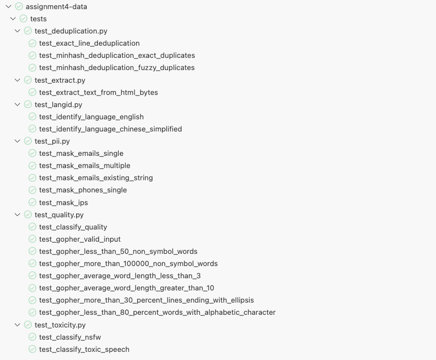
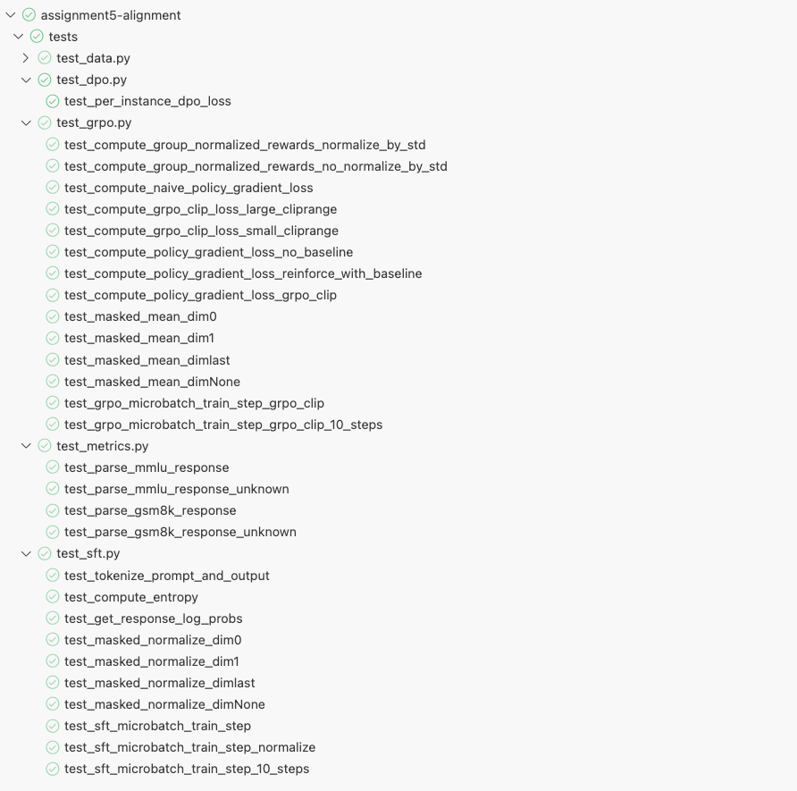

  <h1 align="center">Stanford-CS336: Language Modeling from Scratch</h1>
  

    <h3 align='center'>Personal implementation version</h3>
    

      
      
	  

    

        Thank you for this excellent course! ⭐
    

  

## Preamble

This repository contains my personal implementations for the assignments of Stanford's CS336 course, along with answers to some related questions (note: the content is for reference only and may not be entirely accurate).

Large language models have been a highly popular topic in recent years, and related technologies are frequently discussed (e.g., GRPO as mentioned by DeepSeek). While many excellent libraries and tools have made it convenient to use and train large models, I still have many questions about certain technical details (for instance: how does tokenization actually work in large models? Why does the vocabulary file `vocab.json` often appear to contain no Chinese tokens?).

This course is exceptionally rigorous and well-designed—it guides students through building a large language model from scratch. The amount of coding required even made me wonder how this could be a one-semester course. That said, the process was undoubtedly rewarding and helped me solidify many foundational concepts.

I worked intermittently over a period of time and completed most of the assignment tasks. However, due to limited resources (lacking a GPU with sufficient memory), I skipped a few parts. For the sake of completeness, I’ve organized and shared the code I developed as a record of my learning. Although several assignments are placed in the same repository, each was originally an independent project, and instructions for each can be found in their respective directories.

| Assignment (official repo)                                   | Highlight                                                    | writeup                                                      |
| :----------------------------------------------------------- | ------------------------------------------------------------ | :----------------------------------------------------------- |
| [Basics](https://github.com/stanford-cs336/assignment1-basics/tree/main) | 1.Byte-pair encoding 2.Tokenizer 3.Transformer 4.Ablation | [writeup.md](assignment1-basics/writeup.md)                  |
| [Systems](https://github.com/stanford-cs336/assignment2-systems/tree/main) | 1.FlashAttention 2 2.Profiling and Benchmarking           | [writeup.md](assignment2-systems/writeup.md)                 |
| [Scaling](https://github.com/stanford-cs336/assignment3-scaling/tree/main) | 1.Scaling Law in LLM                                         | [writeup.md](assignment3-scaling/writeup.md)                 |
| [Data](https://github.com/stanford-cs336/assignment4-data/tree/main) | 1.The Common Crawl Dataset                                   | [writeup.md](assignment4-data/writeup.md)                    |
| [Alignment and Reasoning RL](https://github.com/stanford-cs336/assignment5-alignment) | 1.SFT 2.GRPO 3.DPO                                     | [writeup.md](assignment5-alignment/writeup.md) [writeup_sup.md](assignment5-alignment/writeup_sup.md) |

## Pass all test points

Show a screenshot of passing all test cases — it feels really satisfying to see.

    
    
Assignment 1 passed all tests.

    
    
Assignment 2 passed all tests.

    
    
Assignment 4 passed all tests.

    
    
Assignment 5 passed all tests.

