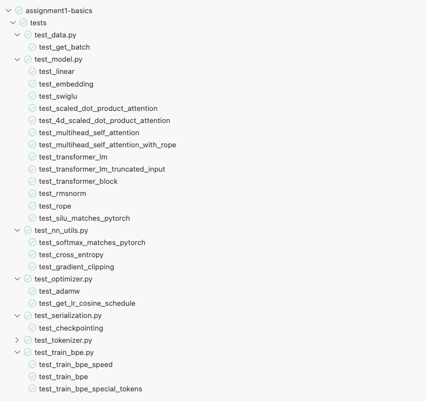
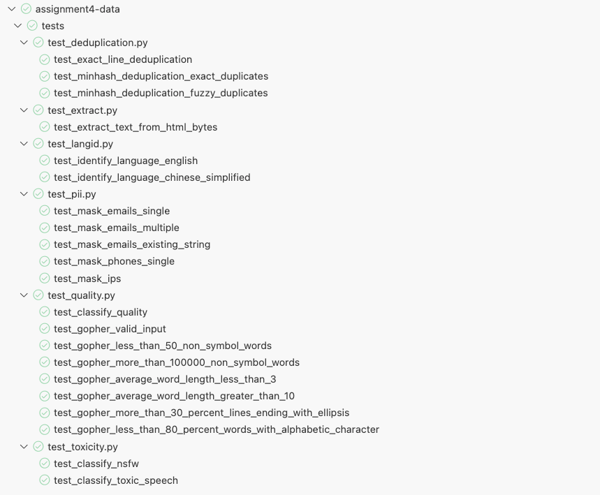

  <h1 align="center">Stanford-CS336: 从零构建大语言模型</h1>
  

    <h3 align='center'>个人实现版本</h3>
    

      
	  

    

        非常感谢这门优秀的课程! ⭐
    

  

## 碎碎念

这个仓库包含了我个人对于斯坦福CS336这门课程作业的实现以及一些问题的回答（内容仅供参考）。

大语言模型是这两年很火的话题，与之相关的技术也频繁出现在视野中（比如DeepSeek提到的GRPO）。如今，许多优秀的封装工具让调用大模型以及训练大模型很方便，但我对于其中的部分实现细节依然有很多疑惑（比如大模型中的分词到底是什么，为什么模型词表文件`vacab.json`里面看到的没有中文）。

这门课程非常硬核，非常优秀，从零构建大语言模型，代码量之大，它的代码量都让我怀疑这竟然是一学期的一门课。但不可否认，整个过程让我收获颇丰，顺带重新复习了一遍基础知识。

我断断续续花了一点时间把这几个作业的大部分内容完成了，不过由于资源有限（没有足够大内存的GPU），也跳过了部分的内容。有始有终，我把这个过程中完成的代码整理完成分享出来，作为一段学习记录。虽然几个作业都放在同一个仓库中，但每一个其实原本都是独立的项目，每个作业的完成说明可以在对应的目录下查看。

如果你发现了代码中存在任何问题，欢迎一起讨论！

| 作业 (官方仓库)                                              | 亮点                                                         | 笔记                                                         |
| :----------------------------------------------------------- | ------------------------------------------------------------ | :----------------------------------------------------------- |
| [Basics](https://github.com/stanford-cs336/assignment1-basics/tree/main) | 1.Byte-pair encoding 2.Tokenizer 3.Transformer 4.Ablation | [writeup.md](assignment1-basics/writeup.md)                  |
| [Systems](https://github.com/stanford-cs336/assignment2-systems/tree/main) | 1.FlashAttention 2 2.Profiling and Benchmarking           | [writeup.md](assignment2-systems/writeup.md)                 |
| [Scaling](https://github.com/stanford-cs336/assignment3-scaling/tree/main) | 1.Scaling Law in LLM                                         | [writeup.md](assignment3-scaling/writeup.md)                 |
| [Data](https://github.com/stanford-cs336/assignment4-data/tree/main) | 1.The Common Crawl Dataset                                   | [writeup.md](assignment4-data/writeup.md)                    |
| [Alignment and Reasoning RL](https://github.com/stanford-cs336/assignment5-alignment) | 1.SFT 2.GRPO 3.DPO                                     | [writeup.md](assignment5-alignment/writeup.md) [writeup_sup.md](assignment5-alignment/writeup_sup.md) |

## 通过所有测试点

展示一下通过所有测试点的截图，看着还是挺有正反馈的。

    
    
作业1通过全部测试

    
    
作业2通过全部测试

    
    
作业4通过全部测试

    
    
作业5通过全部测试

