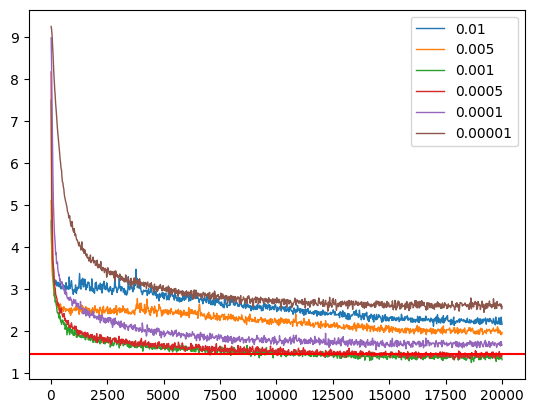
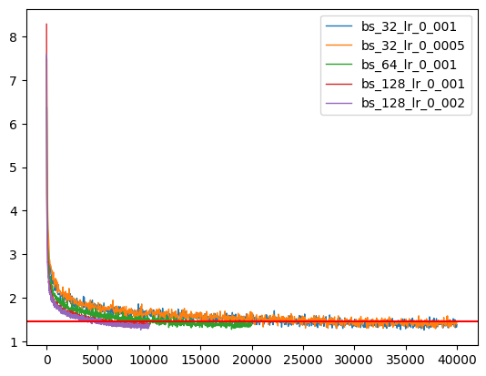
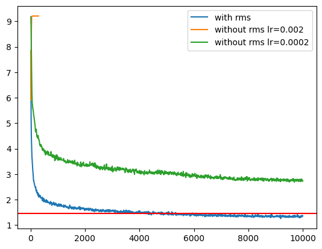
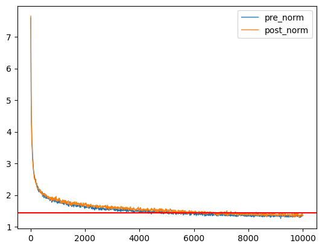
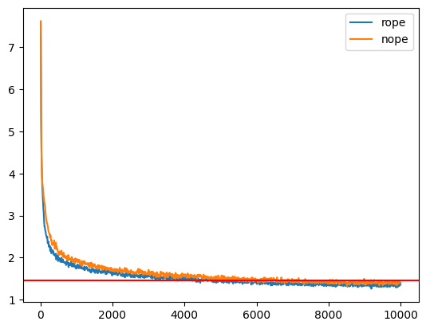
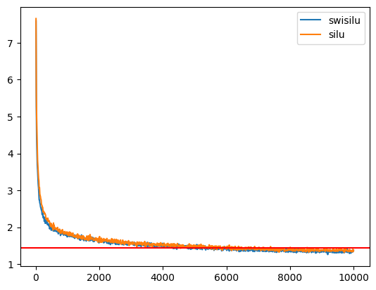

# CS336 Assignment 1 (basics): Building a Transformer LM
[TOC]


## 2 Byte-Pair Encoding (BPE) Tokenizer

### Problem (unicode1): Understanding Unicode (1 point)

(a) What Unicode character does chr(0) return?

**Deliverable:** chr(0) represents the null character in the ASCII code, which is used in computing to signify the end of a string.

(b) How does this character’s string representation (\__repr__()) differ from its printed representation?

**Deliverable:** '\x00'

(c) What happens when this character occurs in text? It may be helpful to play around with the following in your Python interpreter and see if it matches your expectations:

```python
>>> chr(0) 																				# '\x00'
>>> print(chr(0)) 																# 
>>> "this is a test" + chr(0) + "string" 					# 'this is a test\x00string'
>>> print("this is a test" + chr(0) + "string") 	# this is a teststring
```

**Deliverable:** It is invisible when use print.


### Problem (unicode2): Unicode Encodings (3 points)

(a) What are some reasons to prefer training our tokenizer on UTF-8 encoded bytes, rather than UTF-16 or UTF-32? It may be helpful to compare the output of these encodings for various input strings.

**Deliverable:** UTF-8 is a variable-length encoding, which is more space-efficient compared to UTF-16 and UTF-32.

(b) Consider the following (incorrect) function, which is intended to decode a UTF-8 byte string into a Unicode string. Why is this function incorrect? Provide an example of an input byte string that yields incorrect results.

```python
def decode_utf8_bytes_to_str_wrong(bytestring: bytes):
		return "".join([bytes([b]).decode("utf-8") for b in bytestring])

>>> decode_utf8_bytes_to_str_wrong("hello".encode("utf-8"))
>>> 'hello'
```

**Deliverable:** This won't work with Chinese because Chinese characters use more than one byte, and individual bytes cannot be properly decoded. 

(c) Give a two byte sequence that does not decode to any Unicode character(s).

**Deliverable:** b'\xe0\x80'，it represent need 3 bytes to decode.


### Problem (train_bpe): BPE Tokenizer Training (15 points)

Deliverable: Write a function that, given a path to an input text file, trains a (byte-level) BPE tokenizer.

- [x] See function `train_bpe` in `assignment1-basics/cs336_basics/bpe.py` 

```sh
# test shell
pytest tests/test_train_bpe.py
```


### Problem (train_bpe_tinystories): BPE Training on TinyStories (2 points)

(a) Train a byte-level BPE tokenizer on the TinyStories dataset, using a maximum vocabulary size of 10,000. Make sure to add the TinyStories <|endoftext|> special token to the vocabulary. Serialize the resulting vocabulary and merges to disk for further inspection. How many hours and memory did training take? What is the longest token in the vocabulary? Does it make sense?

Resource requirements: ≤ 30 minutes (no GPUs), ≤ 30GB RAM Hint You should be able to get under 2 minutes for BPE training using multiprocessing during pretokenization and the following two facts:

(a) The <|endoftext|> token delimits documents in the data files.

(b) The <|endoftext|> token is handled as a special case before the BPE merges are applied.

**Deliverable:** 1minute. The longest token in the vocabulary is b' accomplishment'. Make sense.

```sh
# run shell
python script/train_bpe_tinystories.py
```

> terminal output:
>
> pretokenize: 51.90345621109009
> merge BEP: 6.766570568084717
> total_time: 58.67015552520752
> Memory before use: 51.6015625 MB
> Memory after use: 110.81640625 MB
> Peak memory usage: 110.81640625 MB
> Memory increase: 59.21484375 MB
> longest token in the vocabulary is: b' accomplishment'

(b) Profile your code. What part of the tokenizer training process takes the most time?

**Deliverable:** Loading corpus data and pretokenization cost the most time.


**Addtional Experiments: (you can ignore)**

When implementing BPE, I went through several versions of iterative optimization. Here, I record the experimental process.

- **ori**: Represents the simplest version, which fails the speed test on some devices. 

- **merge_opt**: Represents the optimized merge operation, which involves incrementally updating the occurrence frequency of byte pairs.
- **multiprocess**: Indicates the addition of multi-threaded operations; by default, 10 threads are used.
- **mem_opt**: During experimentation, it was observed that the merge operation becomes progressively slower with each iteration, and memory usage gradually increases. This version addresses that.

> See function `train_bep_before_merge_optimization` in `cs336_basics/bpe_ablation.py`
>
> See function `train_bpe_without_memory_opt` in  `cs336_basics/bpe_ablation.py`


Time pass the test function :

|                 | ori   | ori+merge_opt | ori+merge_opti+multiprocess | ori+merge_opti+multiprocess+mem_opt |
| --------------- | ----- | ------------- | --------------------------- | ----------------------------------- |
| totol pass time | 10.71 | 1.52          | 0.68                        | 0.65                                |

Performance in Tinystroies: 

|                                       | RAM     | pretokenize | merge BEP | totol time |
| ------------------------------------- | ------- | ----------- | --------- | ---------- |
| ori                                   | 2326 MB | 319         | 384       | 704        |
| ori+merge_opt                         | 503 MB  | 296         | 18        | 314        |
| ori+merge_opt+multiprocess            | 70 MB   | 49          | 18        | 67         |
| ori+merge_opt+multiprocess+memory_opt | 60 MB   | 49          | 14        | 63         |


### Problem (train_bpe_expts_owt): BPE Training on OpenWebText (2 points)

(a) Train a byte-level BPE tokenizer on the OpenWebText dataset, using a maximum vocabulary size of 32,000. Serialize the resulting vocabulary and merges to disk for further inspection. What is the longest token in the vocabulary? Does it make sense?

**Deliverable:**  The longest token in the vocabulary is b'\xc3\x83\xc3\x82\xc3\x83\xc3\x82\xc3\x83\xc3\x82\xc3\x83\xc3\x82\xc3\x83\xc3\x82\xc3\x83\xc3\x82\xc3\x83\xc3\x82\xc3\x83\xc3\x82\xc3\x83\xc3\x82\xc3\x83\xc3\x82\xc3\x83\xc3\x82\xc3\x83\xc3\x82\xc3\x83\xc3\x82\xc3\x83\xc3\x82\xc3\x83\xc3\x82\xc3\x83\xc3\x82\xc3\x83\xc3\x82\xc3\x83\xc3\x82\xc3\x83\xc3\x82\xc3\x83\xc3\x82\xc3\x83\xc3\x82\xc3\x83\xc3\x82\xc3\x83\xc3\x82\xc3\x83\xc3\x82\xc3\x83\xc3\x82\xc3\x83\xc3\x82\xc3\x83\xc3\x82\xc3\x83\xc3\x82\xc3\x83\xc3\x82\xc3\x83\xc3\x82\xc3\x83\xc3\x82\xc3\x83\xc3\x82'.

```sh
# run shell
python script/train_bpe_expts_owt.py
```

(b) Compare and contrast the tokenizer that you get training on TinyStories versus OpenWebText.

**Deliverable:** OpenWebText is more complex.


### Problem (tokenizer): Implementing the tokenizer (15 points)

**Deliverable:** Implement a Tokenizer class that, given a vocabulary and a list of merges, encodes text into integer IDs and decodes integer IDs into text. Your tokenizer should also support user-provided special tokens (appending them to the vocabulary if they aren’t already there).

- [x] See class `Tokenizer` in `cs336_basics/tokenizer.py`

```sh
# test shell
pytest tests/test_tokenizer.py
```


### Problem (tokenizer_experiments): Experiments with tokenizers (4 points)

(a) Sample 10 documents from TinyStories and OpenWebText. Using your previously-trained TinyStories and OpenWebText tokenizers (10K and 32K vocabulary size, respectively), encode these sampled documents into integer IDs. What is each tokenizer’s compression ratio (bytes/token)?

**Deliverable:** The tinystories compression ratio bytes/token: 4.0. The owt compression ratio bytes/token: 4.5.

(b) What happens if you tokenize your OpenWebText sample with the TinyStories tokenizer? Compare the compression ratio and/or qualitatively describe what happens.

**Deliverable:** The tinystories encoded by owt tokenizer compression ratio bytes/token: 3.89. The owt encoded by tinystories tokenizer compression ratio bytes/token: 3.41. It drops.

(c) Estimate the throughput of your tokenizer (e.g., in bytes/second). How long would it take to tokenize the Pile dataset (825GB of text)?

**Deliverable:** The tinystories tokenizer throughput: 914412. The cost days is 825 * 10^9 / 914412 / 3600 / 24 =10.44.

(d) Using your TinyStories and OpenWebText tokenizers, encode the respective training and development datasets into a sequence of integer token IDs. We’ll use this later to train our language model. We recommend serializing the token IDs as a NumPy array of datatype uint16. Why is uint16 an appropriate choice?

**Deliverable:** 16 bits enough for cover the vocab size 32_000.

```python
# run shell
python script/tokenizer_experiments.py
```


## 3 Transformer Language Model Architecture

### Problem (linear): Implementing the linear module (1 point)

**Deliverable:** Implement a Linear class that inherits from torch.nn.Module and performs a linear transformation. Your implementation should follow the interface of PyTorch’s built-in nn.Linear module, except for not having a bias argument or parameter.

For initializations, use the settings from above along with torch.nn.init.trunc_normal_ to initialize the weights.

- [x] See class `Linear` in `cs336_basics/module.py`

```sh
# test shell
pytest -k test_linear
```


### Problem (embedding): Implement the embedding module (1 point)

**Deliverable:** Implement the Embedding class that inherits from torch.nn.Module and performs an embedding lookup. Your implementation should follow the interface of PyTorch’s built-in nn.Embedding module.

Again, use the settings from above for initialization, and use torch.nn.init.trunc_normal_ to initialize the weights.

- [x] See class `Embedding` in `cs336_basics/module.py`

```sh
# test shell
pytest -k test_embedding
```


### Problem (rmsnorm): Root Mean Square Layer Normalization (1 point)

**Deliverable:** Implement RMSNorm as a torch.nn.Module.

Remember to upcast your input to torch.float32 before performing the normalization (and later downcast to the original dtype), as described above.

- [x] See class `RMSNorm` in `cs336_basics/module.py`

```sh
# test shell
pytest -k test_rmsnorm
```


### Problem (positionwise_feedforward): Implement the position-wise feed-forward network (2 points)

**Deliverable:** Implement the SwiGLU feed-forward network, composed of a SiLU activation function and a GLU.

Note: in this particular case, you should feel free to use torch.sigmoid in your implementation for numerical stability.

- [x] See class `PositionwiseFeedForward` in `cs336_basics/module.py`

```sh
# test shell
pytest -k test_swiglu
```


### Problem (rope): Implement RoPE (2 points)

**Deliverable:** Implement a class RotaryPositionalEmbedding that applies RoPE to the input tensor.

- [x] See class `RotaryPositionEmbedding` in `cs336_basics/module.py`

```sh
# test shell
pytest -k test_rope
```


### Problem (softmax): Implement softmax (1 point)

**Deliverable:** Write a function to apply the softmax operation on a tensor. Your function should take two parameters: a tensor and a dimension i, and apply softmax to the i-th dimension of the input tensor. The output tensor should have the same shape as the input tensor, but its i-th dimension will now have a normalized probability distribution. Use the trick of subtracting the maximum value in the i-th dimension from all elements of the i-th dimension to avoid numerical stability issues.

- [x] See function `softmax` in `cs336_basics/utils.py`

```sh
# test shell
pytest -k test_softmax_matches_pytorch
```


### Problem (scaled_dot_product_attention): Implement scaled dot-product attention (5 points)

**Deliverable:** Implement the scaled dot-product attention function. Your implementation should handle keys and queries of shape (batch_size, ..., seq_len, d_k) and values of shape (batch_size, ..., seq_len, d_v), where ... represents any number of other batch-like dimensions (if provided). The implementation should return an output with the shape (batch_size, ..., d_v). See section 3.3 for a discussion on batch-like dimensions.

Your implementation should also support an optional user-provided boolean mask of shape (seq_len, seq_len). The attention probabilities of positions with a mask value of True should collectively sum to 1, and the attention probabilities of positions with a mask value of False should be zero.

- [x] See function `scaled_dot_product_attention` in `cs336_basics/modules.py`

```sh
# test shell
pytest -k test_4d_scaled_dot_product_attention
```


### Problem (multihead_self_attention): Implement causal multi-head self-attention points)

**Deliverable:** Implement causal multi-head self-attention as a torch.nn.Module. Your implementation should accept (at least) the following parameters:

- [x] See class `MultiHeadSelfAttention` in `cs336_basics/modules.py`

```sh
# test shell
pytest -k test_multihead_self_attention
```


### Problem (transformer_block): Implement the Transformer block (3 points)

Implement the pre-norm Transformer block as described in §3.5 and illustrated in Figure 2. Your Transformer block should accept (at least) the following parameters.

- [x] See class `TransformerBlock` in `cs336_basics/modules.py`

```sh
# test shell
pytest -k test_transformer_block
```


### Problem (transformer_lm): Implementing the Transformer LM (3 points)

Time to put it all together! Implement the Transformer language model as described in §3.1 and illustrated in Figure 1. At minimum, your implementation should accept all the aforementioned construction parameters for the Transformer block, as well as these additional parameters:

- [x] See class `TransformerLM` in `cs336_basics/modules.py`

```sh
# test shell
pytest -k test_transformer_lm
```


### Problem (transformer_accounting): Transformer LM resource accounting (5 points)

(a) Consider GPT-2 XL, which has the following configuration:

vocab_size : 50,257
context_length : 1,024
num_layers : 48
d_model : 1,600
num_heads : 25 
d_ff : 6,400

Suppose we constructed our model using this configuration. How many trainable parameters would our model have? Assuming each parameter is represented using single-precision floating point, how much memory is required to just load this model?

**Deliverable:** It need 2,127,057,600 parameters to train. Include embedding: 80,411,200, mha: 491,520,000, rms: 153,600, ffn: 1,474,560,000, final_rms: 1,600, lm_head: 80,411,200. It require 8.5 GB memory to just load the model.
$$
\begin{aligned}
embedding& = vocab\_size\times d_{model}\\
mha& = 4\times d_{model}\times context\_length\\
ffn& = 3\times d_{model}\times d_{ff}\\
rms& = 2\times d_{model}\\
final\_{rms}& = d_{model}\\
lm\_{head}& = d_{model}\times vocab\_size\\
paprameters&=embedding + (mha+ffn+rms)\times layers+final\_{rms} + lm\_{head}
\end{aligned}
$$

```python
# run shell
python script/transformer_accounting.py
```

```sh
embedding: 80411200, mha: 491520000, rms: 153600, ffn: 1474560000, final_rms: 1600, lm_head: 80411200
total: 2127057600
```

(b) Identify the matrix multiplies required to complete a forward pass of our GPT-2 XL-shaped model. How many FLOPs do these matrix multiplies require in total? Assume that our input sequence has context_length tokens.
$$
\begin{aligned}
embedding&=0\\
mha &= 2\times(4\times d_{model}^2\times context\_length+2\times d_{model}\times context\_{length}^2)\\
ffn&=2\times (3\times context\_length\times d_{model}\times d_{ff})\\
rms&=2\times (2\times d_{model}\times context\_length)\\
final\_rms &= 2\times (d_{model}\times context\_length)\\
lm\_{head} & = 2\times (context\_length\times  d_{model}\times vocab\_{size})\\
flops&=embedding + (mha+ffn+rms)\times layers + final\_rms + lm\_{head}
\end{aligned}
$$
**Deliverable:** 4,513,654,374,400 FLOPS. MHA: 1328.76 GFLOPS, FFN: 3019.90 GFLOPS, RMS: 0.31 GFLOPS, LM_HEAD: 164.68 GFLOPS.

(c) Based on your analysis above, which parts of the model require the most FLOPs?

**Deliverable:** The FFN takes the majority of the FLOPS.

(d) Repeat your analysis with GPT-2 small (12 layers, 768 d_model, 12 heads), GPT-2 medium (24 layers, 1024 d_model, 16 heads), and GPT-2 large (36 layers, 1280 d_model, 20 heads). As the model size increases, which parts of the Transformer LM take up proportionally more or less of the total FLOPs?

For each model, provide a breakdown of model components and its associated FLOPs (as a proportion of the total FLOPs required for a forward pass). In addition, provide a one-to-two sentence description of how varying the model size changes the proportional FLOPs of each component.

```python
------------------------------ GPT-2 XL ------------------------------
embedding: 0.00 GFLOPS (0.00%)
mha: 1328.76 GFLOPS (29.44%)
ffn: 3019.90 GFLOPS (66.91%)
rms: 0.31 GFLOPS (0.01%)
final_rms: 0.00 GFLOPS (0.00%)
lm_head: 164.68 GFLOPS (3.65%)
TOTAL: 4513654374400 FLOPS (100.00%)
------------------------------ GPT-2 Large ------------------------------
embedding: 0.00 GFLOPS (0.00%)
mha: 676.46 GFLOPS (25.82%)
ffn: 1811.94 GFLOPS (69.15%)
rms: 0.19 GFLOPS (0.01%)
final_rms: 0.00 GFLOPS (0.00%)
lm_head: 131.75 GFLOPS (5.03%)
TOTAL: 2620333752320 FLOPS (100.00%)
------------------------------ GPT-2 Medium ------------------------------
embedding: 0.00 GFLOPS (0.00%)
mha: 309.24 GFLOPS (22.39%)
ffn: 966.37 GFLOPS (69.97%)
rms: 0.10 GFLOPS (0.01%)
final_rms: 0.00 GFLOPS (0.00%)
lm_head: 105.40 GFLOPS (7.63%)
TOTAL: 1381104615424 FLOPS (100.00%)
------------------------------ GPT-2 Small ------------------------------
embedding: 0.00 GFLOPS (0.00%)
mha: 96.64 GFLOPS (17.96%)
ffn: 362.39 GFLOPS (67.34%)
rms: 0.04 GFLOPS (0.01%)
final_rms: 0.00 GFLOPS (0.00%)
lm_head: 79.05 GFLOPS (14.69%)
TOTAL: 538111377408 FLOPS (100.00%)
```

**Deliverable:** The FFN computations increasingly dominate as model size increases. The contribution from the LM head is significant (greater than the contribution from attention) at the smallest model size, and diminishes quickly as model size increases.


### Problem (cross_entropy): Implement Cross entropy

**Deliverable:** Write a function to compute the cross entropy loss, which takes in predicted logits $(o_i)$ and targets $(x_{i+1})$ and computes the cross entropy$\mathcal{l}_i=-\log \text{softmax}(o_i)[x_{i+1}]$. Your function should handle the following:

• Subtract the largest element for numerical stability.

• Cancel out log and exp whenever possible.

• Handle any additional batch dimensions and return the average across the batch. As with section 3.3, we assume batch-like dimensions always come first, before the vocabulary size dimension.

- [x] See function `cross_entropy_loss` in `cs336_basics/utils.py`

```sh
# test shell
pytest -k test_cross_entropy
```


### Problem (learning_rate_tuning): Tuning the learning rate (1 point)

As we will see, one of the hyperparameters that affects training the most is the learning rate. Let’s see that in practice in our toy example. Run the SGD example above with three other values for the learning rate: 1e1, 1e2, and 1e3, for just 10 training iterations. What happens with the loss for each of these learning rates? Does it decay faster, slower, or does it diverge (i.e., increase over the course of training)?

**Deliverable:** For learning rates of 1, 1e1, and 1e2, the loss decreases more quickly as the learning rate is increased. With a learning rate of 1e3, the loss diverges.

```sh
# run shell
python cs336_basics/optimizer.py
```


### Problem (adamw): Implement AdamW (2 points)

**Deliverable:** Implement the AdamW optimizer as a subclass of torch.optim.Optimizer.

- [x] See class `AdamW` in `cs336_basics/optimizer.py`

```sh
# test shell
pytest -k test_adamw
```


### Problem (adamwAccounting): Resource accounting for training with AdamW (2 points)

Let us compute how much memory and compute running AdamW requires. Assume we are using float32 for every tensor.

(a) How much peak memory does running AdamW require? Decompose your answer based on the memory usage of the parameters, activations, gradients, and optimizer state. Express your answer in terms of the batch_size and the model hyperparameters (vocab_size, context_length, num_layers, d_model, num_heads). Assume d_ff = 4 × d_model.

For simplicity, when calculating memory usage of activations, consider only the following components:

- Transformer block
    - RMSNorm(s)
    - Multi-head self-attention sublayer: $QKV$ projections, $Q^⊤K$ matrix multiply, softmax, weighted sum of values, output projection.
    - Position-wise feed-forward: $W_1$matrix multiply, SiLU, $W_2$ matrix multiply.
- final RMSNorm
- output embedding
- cross-entropy on logits

**Deliverable:** 53.45GB whe batch size is 1 and 72.85 GB whe batch size is 2.

```sh
# Activation:
# Tansformer Block
residule = 2 * bs * context_length * d_model

# MHA
qkv_proj = 3 * bs * context_length * d_model
qk_mat = bs * num_heads * context_length * context_length
softmax_qk_mat = bs * num_heads * context_length * context_length
qkv = bs * context_length * d_model
mha_output = bs * context_length * d_model

# FFN
w1 = bs * context_length * d_ff
w3 = bs * context_length * d_ff
silu = bs * context_length * d_ff
w1_w3_elementwise = bs * context_length * d_ff
ffn_output = bs * context_length * d_ff

# RMS
rms = bs * context_length * d_model

# Final RMS
final_rms = bs * context_length * d_model

# LM head
lm_head = bs * context_length * vocab_size
loss = bs * context_length
```


(b) Instantiate your answer for a GPT-2 XL-shaped model to get an expression that only depends on the batch_size. What is the maximum batch size you can use and still fit within 80GB memory?

**Deliverable:**  An expression that looks like a · batch_size + b for numerical values a, b, and a number representing the maximum batch size.
$$
19.4\times batch\_{size}+8.51\times4
$$

(c) How many FLOPs does running one step of AdamW take?

**Deliverable:** Just estiminate. Foward process takes about $2\times bs \times Token\times Parameters$.

(d) Model FLOPs utilization (MFU) is defined as the ratio of observed throughput (tokens per second) relative to the hardware’s theoretical peak FLOP throughput [Chowdhery et al., 2022]. An NVIDIA A100 GPU has a theoretical peak of 19.5 teraFLOP/s for float32 operations. Assuming you are able to get 50% MFU, how long would it take to train a GPT-2 XL for 400K steps and a batch size of 1024 on a single A100? Following Kaplan et al. [2020] and Hoffmann et al. [2022], assume that the backward pass has twice the FLOPs of the forward pass.

**Deliverable:** The number of days training would take, with a brief justification. 400K * 6 * 1024 * 1024 * 2.13G/9.75T/3600/24=6,363 days


### Problem (learning_rate_schedule): Implement cosine learning rate schedule with warmup

Write a function that takes $t$, $\alpha_{max}$ , $\alpha_{min}$ , $T_w$ and $T_c$ , and returns the learning rate α t according to the scheduler defined above.

- [x] See function `get_lr_cosine_schedule` in `cs336_basics/utils.py`

```sh
# test shell
pytest -k test_get_lr_cosine_schedule
```


### Problem (gradient_clipping): Implement gradient clipping (1 point)

Write a function that implements gradient clipping. Your function should take a list of parameters and a maximum $l_2-norm$.

- [x] See function `gradient_clipping` in `cs336_basics/utils.py`

```sh
# test shell
pytest -k test_gradient_clipping
```


## 5 Training loop

### Problem (data_loading): Implement data loading (2 points)

**Deliverable**: Write a function that takes a numpy array x (integer array with token IDs), a batch_size, a context_length and a PyTorch device string (e.g., 'cpu' or 'cuda:0'), and returns a pair of tensors: the sampled input sequences and the corresponding next-token targets. Both tensors should have shape (batch_size, context_length) containing token IDs, and both should be placed on the requested device.

- [x] See function `get_batch` in `cs336_basics/utils.py`

```sh
# test shell
pytest -k test_get_batch
```


### Problem (checkpointing): Implement model checkpointing (1 point)

Implement the following two functions to load and save checkpoints:

- [x] See function `save_checkpoint` in `cs336_basics/utils.py`

- [x] See function `load_checkpoint` in `cs336_basics/utils.py`

```sh
# test shell
pytest -k test_checkpointing
```


### Problem (training_together): Put it together (4 points)

**Deliverable:** Write a script that runs a training loop to train your model on user-provided input. In particular, we recommend that your training script allow for (at least) the following:

• Ability to configure and control the various model and optimizer hyperparameters.

• Memory-efficient loading of training and validation large datasets with np.memmap.

• Serializing checkpoints to a user-provided path.

• Periodically logging training and validation performance (e.g., to console and/or an external service like Weights and Biases).a

- [x] See `train_loop.py`


## 6 Generating text

### Problem (decoding): Decoding (3 points)

**Deliverable:** Implement a function to decode from your language model. We recommend that you support the following features:

- Generate completions for a user-provided prompt (i.e., take in some x 1...t and sample a completion until you hit an <|endoftext|> token).

- Allow the user to control the maximum number of generated tokens.

- Given a desired temperature value, apply softmax temperature scaling to the predicted next-word distributions before sampling.

- Top-p sampling (Holtzman et al., 2020; also referred to as nucleus sampling), given a user-specified threshold value.

- [x] See function `generate_text` in class `TransformerLM` in `cs336_basics/module.py`


## 7 Experiments

### Problem (experiment_log): Experiment logging (3 points)

For your training and evaluation code, create experiment tracking infrastructure that allows you to track your experiments and loss curves with respect to gradient steps and wallclock time.

**Deliverable:** Logging infrastructure code for your experiments and an experiment log (a document of all the things you tried) for the assignment problems below in this section.

`wandb` is not available! 


### Problem (learning_rate): Tune the learning rate (3 points)

The learning rate is one of the most important hyperparameters to tune. Taking the base model you’ve trained, answer the following questions:

(a) Perform a hyperparameter sweep over the learning rates and report the final losses (or note divergence if the optimizer diverges).

**Deliverable:** Learning curves associated with multiple learning rates. Explain your hyperparameter search strategy.

**Deliverable:** A model with validation loss (per-token) on TinyStories of at most 1.45

(b) Folk wisdom is that the best learning rate is “at the edge of stability.” Investigate how the point at which learning rates diverge is related to your best learning rate.

**Deliverable:** Learning curves of increasing learning rate which include at least one divergent run and an analysis of how this relates to convergence rates.




### Problem (batch_size_experiment): Batch size variations (1 point)

Vary your batch size all the way from 1 to the GPU memory limit. Try at least a few batch sizes in between, including typical sizes like 64 and 128.

**Deliverable:** Learning curves for runs with different batch sizes. The learning rates should be optimized again if necessary.

**Deliverable:** A few sentences discussing of your findings on batch sizes and their impacts on training.




### Problem (generate): Generate text (1 point)

Using your decoder and your trained checkpoint, report the text generated by your model. You may need to manipulate decoder parameters (temperature, top-p, etc.) to get fluent outputs.

**Deliverable:** Text dump of at least 256 tokens of text (or until the first <|endoftext|> token), and a brief comment on the fluency of this output and at least two factors which affect how good or bad this output is.


### Problem (layer_norm_ablation): Remove RMSNorm and train (1 point)

Remove all of the RMSNorms from your Transformer and train. What happens at the previous optimal learning rate? Can you get stability by using a lower learning rate?

**Deliverable:** A learning curve for when you remove RMSNorms and train, as well as a learning curve for the best learning rate.

**Deliverable:** A few sentence commentary on the impact of RMSNorm.




### Problem (pre_norm_ablation): Implement post-norm and train (1 point)

Modify your pre-norm Transformer implementation into a post-norm one. Train with the post-norm model and see what happens.

**Deliverable:** A learning curve for a post-norm transformer, compared to the pre-norm one.




### Problem (no_pos_emb): Implement NoPE (1 point)

Modify your Transformer implementation with RoPE to remove the position embedding information entirely, and see what happens.

**Deliverable:** A learning curve comparing the performance of RoPE and NoPE.




### Problem (swiglu_ablation): SwiGLU vs. SiLU (1 point)

**Deliverable:** A learning curve comparing the performance of SwiGLU and SiLU feed-forward networks, with approximately matched parameter counts.

**Deliverable:** A few sentences discussing your findings.

