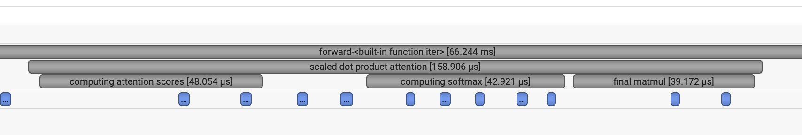

# CS336 Assignment 2 (systems): Systems and Parallelism
[TOC]

## 1 Assignment Overview

### Problem (benchmarking_script): 4 points

(a) Write a script to perform basic end-to-end benchmarking of the forward and backward passes in your model. Specifically, your script should support the following:

- Given hyperparameters (e.g., number of layers), initialize a model.

- Generate a random batch of data.

- Run w warm-up steps (before you start measuring time), then time the execution of n steps (either only forward, or both forward and backward passes, depending on an argument). For timing, you can use the Python timeit module (e.g., either using the timeit function, or using timeit.default_timer(), which gives you the system’s highest resolution clock, thus a better default for benchmarking than time.time()).

- Call torch.cuda.synchronize() after each step.

**Deliverable:** A script that will initialize a basics Transformer model with the given hyperparameters, create a random batch of data, and time forward and backward passes.

- [x] See function `benchmarking_script` in `cs336_systems/benchmarking_script.py`

(b) Time the forward and backward passes for the model sizes described in §1.1.2. Use 5 warmup steps and compute the average and standard deviation of timings over 10 measurement steps. How long does a forward pass take? How about a backward pass? Do you see high variability across measurements, or is the standard deviation small?

**Deliverable:** See the table below.

```latex
# 2.7B size and XL size out of memory when batch_size=4, context_length=128
|        |   context |   warm |   iter | forward    | backward    | optimizer   |
|:-------|----------:|-------:|-------:|:-----------|:------------|:------------|
| small  |       128 |      5 |     10 | 12.94±0.32 | 23.22±0.16  | 0.27±0.05   |
| medium |       128 |      5 |     10 | 31.92±0.29 | 71.37±0.56  | 0.32±0.04   |
| large  |       128 |      5 |     10 | 66.19±0.62 | 143.52±0.76 | 0.53±0.05   |

# warm up with 0 iter.
|        |   context |   warm |   iter | forward     | backward     | optimizer   |
|:-------|----------:|-------:|-------:|:------------|:-------------|:------------|
| small  |       128 |      0 |     10 | 29.23±52.09 | 27.01±12.00  | 0.29±0.08   |
| medium |       128 |      0 |     10 | 71.77±77.45 | 72.14±11.40  | 0.77±0.07   |
| large  |       128 |      0 |     10 | 95.10±81.57 | 144.86±10.44 | 1.15±0.07   |

# warm up with 1 iter.
|        |   context |   warm |   iter | forward    | backward    | optimizer   |
|:-------|----------:|-------:|-------:|:-----------|:------------|:------------|
| small  |       128 |      1 |     10 | 11.74±0.14 | 22.83±0.33  | 0.29±0.07   |
| medium |       128 |      1 |     10 | 31.84±0.36 | 71.20±0.34  | 0.31±0.02   |
| large  |       128 |      1 |     10 | 71.83±7.31 | 142.00±0.73 | 1.52±0.08   |
```

(c) One caveat of benchmarking is not performing the warm-up steps. Repeat your analysis without the warm-up steps. How does this affect your results? Why do you think this happens? Also try to run the script with 1 or 2 warm-up steps. Why might the result still be different?

**Deliverable:** Without warmup, the standard deviations are much larger.  If you use it once, it will be much better.


### Problem (nsys_profile): 5 points

Profile your forward pass, backward pass, and optimizer step using nsys with each of the model sizes described in Table 1 and context lengths of 128, 256, 512 and 1024 (you may run out of memory with some of these context lengths for the larger models, in which case just note it in your report).

- [x] See code in `cs336_systems/nsys_profile.py`

(a) What is the total time spent on your forward pass? Does it match what we had measured before with the Python standard library?

**Deliverable:** The recorded time is very close to that recorded in the standard library.

|        | forward | backward | optimizer |
| ------ | ------- | -------- | --------- |
| small  | 12.760  | 23.215   | 0.235     |
| medium | 31.996  | 70.708   | 0.401     |
| large  | 65.980  | 143.106  | 0.521     |

(b) What CUDA kernel takes the most cumulative GPU time during the forward pass? How many times is this kernel invoked during a single forward pass of your model? Is it the same kernel that takes the most runtime when you do both forward and backward passes? (Hint: look at the “CUDA GPU Kernel Summary” under “Stats Systems View”, and filter using NVTX ranges to identify which parts of the model are responsible for which kernels.)

**Deliverable:** 253 times ampere_sgemm_128x64_tn

(c) Although the vast majority of FLOPs take place in matrix multiplications, you will notice that several other kernels still take a non-trivial amount of the overall runtime. What other kernels besides matrix multiplies do you see accounting for non-trivial CUDA runtime in the forward pass?

**Deliverable:** The elementwise_kernel. 

void at::native::vectorized_elementwise_kernel<(int)4, at::native::float16_copy_kernel_cuda(at::TensorIteratorBase &)::[lambda(float) (instance 1)], std::array<char *, (unsigned long)2>>(int, T2, T3)

(d) Profile running one complete training step with your implementation of AdamW (i.e., the forward pass, computing the loss and running a backward pass, and finally an optimizer step, as you’d do during training). How does the fraction of time spent on matrix multiplication change, compared to doing inference (forward pass only)? How about other kernels?

**Deliverable:** The proportion of multiplication has decreased, while the proportion of elementwise cores and reduction has increased.

(e) Compare the runtime of the softmax operation versus the matrix multiplication operations within the self-attention layer of your model during a forward pass. How does the difference in runtimes compare to the difference in FLOPs?

**Deliverable:** The softmax operation consumes significantly more wall time per FLOP.




### Problem (mixed_precision_accumulation): 1 point

Run the following code and commment on the (accuracy of the) results.

```python
def mixed_precision_accumulation():
    s = torch.tensor(0, dtype=torch.float32)
    for i in range(1000):
        s += torch.tensor(0.01, dtype=torch.float32)
    print(s)

    s = torch.tensor(0, dtype=torch.float16)
    for i in range(1000):
        s += torch.tensor(0.01, dtype=torch.float16)
    print(s)

    s = torch.tensor(0, dtype=torch.float32)
    for i in range(1000):
        s += torch.tensor(0.01, dtype=torch.float16)
    print(s)

    s = torch.tensor(0, dtype=torch.float32)
    for i in range(1000):
        x = torch.tensor(0.01, dtype=torch.float16)
        s += x.type(torch.float32)
    print(s)
    
>> tensor(10.0001)
>> tensor(9.9531, dtype=torch.float16)
>> tensor(10.0021)
>> tensor(10.0021)
```

**Deliverable: ** We can use float32 to obtain the most accurate addition result, but when using float16 for calculation, the decimal part may overflow due to order alignment, resulting in a loss of accuracy.


### Problem (benchmarking_mixed_precision): 2 points

(a) Consider the following model:

```python
class ToyModel(nn.Module):
def __init__(self, in_features: int, out_features: int):
		super().__init__()
    self.fc1 = nn.Linear(in_features, 10, bias=False)
    self.ln = nn.LayerNorm(10)
    self.fc2 = nn.Linear(10, out_features, bias=False)
    self.relu = nn.ReLU()

def forward(self, x: torch.Tensor) -> torch.Tensor:
    x = self.relu(self.fc1(x))
    x = self.ln(x)
    x = self.fc2(x)
    return x
```

Suppose we are training the model on a GPU and that the model parameters are originally in FP32. We’d like to use autocasting mixed precision with FP16. What are the data types of:

**Deliverable:** The data types for each of the components listed above. 

- the model parameters within the autocast context, **[torch.float32]**

- the output of the first feed-forward layer (ToyModel.fc1), **[torch.float16]**

- the output of layer norm (ToyModel.ln), **[torch.float32]**

- the model’s predicted logits,  **[torch.float16]**

- the loss, **[torch.float16]**

- and the model’s gradients? **[torch.float32]**

(b) You should have seen that FP16 mixed precision autocasting treats the layer normalization layer differently than the feed-forward layers. What parts of layer normalization are sensitive to mixed precision? If we use BF16 instead of FP16, do we still need to treat layer normalization differently? Why or why not?

**Deliverable:** The mean and variance offset within LN are sensitive to mixed precision. BF16 matches the dynamic range of FP32. It possible to run LayerNorm in BF16.

(c) Modify your benchmarking script to optionally run the model using mixed precision with BF16. Time the forward and backward passes with and without mixed-precision for each language model size described in §1.1.2. Compare the results of using full vs. mixed precision, and comment on any trends as model size changes. You may find the nullcontext no-op context manager to be useful.

**Deliverable:** A 2-3 sentence response with your timings and commentary.

```python
# float32
|        |   context |   warm |   iter | forward    | backward    | optimizer   |
|:-------|----------:|-------:|-------:|:-----------|:------------|:------------|
| small  |       128 |      5 |     10 | 12.94±0.32 | 23.22±0.16  | 0.27±0.05   |
| medium |       128 |      5 |     10 | 31.92±0.29 | 71.37±0.56  | 0.32±0.04   |
| large  |       128 |      5 |     10 | 66.19±0.62 | 143.52±0.76 | 0.53±0.05   |

# bfloat16
|        |   context |   warm |   iter | forward    | backward   | optimizer   |
|:-------|----------:|-------:|-------:|:-----------|:-----------|:------------|
| small  |       128 |      5 |     10 | 9.89±0.06  | 14.42±0.11 | 0.15±0.00   |
| medium |       128 |      5 |     10 | 19.68±0.08 | 40.86±0.32 | 0.29±0.08   |
| large  |       128 |      5 |     10 | 28.69±0.47 | 83.57±0.67 | 0.38±0.04   |
```


### Problem (memory_profiling): 4 points

pass


### Problem (pytorch_attention): 2 points

(a) Benchmark your attention implementation at different scales. Write a script that will:

- (a) Fix the batch size to 8 and don’t use multihead attention (i.e. remove the head dimension).

- (b) Iterate through the cartesian product of [16, 32, 64, 128] for the head embedding dimension d model , and [256, 1024, 4096, 8192, 16384] for the sequence length.

- (c) Create random inputs Q, K, V for the appropriate size.

- (d) Time 100 forward passes through attention using the inputs.

- (e) Measure how much memory is in use before the backward pass starts, and time 100 backward passes.

- (f) Make sure to warm up, and to call torch.cuda.synchronize() after each forward/backward pass.

```python
# run shell
python cs336_systems/pytorch_attn_benchmarking.py
```

**Deliverable:** see table below

| head_dim | seq_len | fwd_time | bwd_time | memory |
| -------- | ------- | -------- | -------- | ------ |
| 16       | 256     | 0.1      | 0.2      | 19.7   |
| 16       | 1024    | 0.6      | 1.4      | 52.8   |
| 16       | 4096    | 8.7      | 19.0     | 562.7  |
| 16       | 8192    | 33.6     | 74.7     | 2182.1 |
| 16       | 16384   | OOM      | OOM      | OOM    |
| 32       | 256     | 0.1      | 0.2      | 20.2   |
| 32       | 1024    | 0.6      | 1.4      | 54.9   |
| 32       | 4096    | 8.9      | 19.2     | 571.1  |
| 32       | 8192    | 34.5     | 75.5     | 2198.9 |
| 32       | 16384   | OOM      | OOM      | OOM    |
| 64       | 256     | 0.1      | 0.2      | 21.3   |
| 64       | 1024    | 0.7      | 1.4      | 59.1   |
| 64       | 4096    | 9.1      | 19.2     | 587.9  |
| 64       | 8192    | 35.3     | 76.4     | 2232.4 |
| 64       | 16384   | OOM      | OOM      | OOM    |
| 128      | 256     | 0.1      | 0.2      | 23.4   |
| 128      | 1024    | 0.7      | 1.5      | 67.5   |
| 128      | 4096    | 9.9      | 20.2     | 621.4  |
| 128      | 8192    | 38.8     | 79.5     | 2299.5 |
| 128      | 16384   | OOM      | OOM      | OOM    |


### Problem (flash_forward): 15 points

- [x] See functin `forward` in class `FlashAttentionPytorch` in `cs336_systems/flash_attention.py`

```python
# test shell
pytest -k test_flash_forward_pass_pytorch
```


- [x] See function`forward` in class `FlashAttentionTriton` in `cs336_systems/flash_attention.py`

```python
# test shell
pytest -k test_flash_forward_pass_triton
```


### Problem (flash_backward): 5 points

- [x] See function `backward` in class `FlashAttentionPytorch` in `cs336_systems/flash_attention.py`

```python
# test shell
pytest -k test_flash_backward
```


### Problem (flash_benchmarking): 5 points

```python
# run shell
python cs336_systems/flash_benchmarking.py
```

| dtype          | context_length | d_model | torch_fwd_time | torch_bwd_time | torch_total_time | triton_fwd_time | triton_bwd_time | triton_total_time |
| -------------- | -------------- | ------- | -------------- | -------------- | ---------------- | --------------- | --------------- | ----------------- |
| torch.float32  | 128            | 16      | 0.036          | 0.070          | 0.095            | 0.007           | 0.030           | 0.033             |
| torch.float32  | 128            | 32      | 0.033          | 0.070          | 0.097            | 0.009           | 0.031           | 0.036             |
| torch.float32  | 128            | 64      | 0.034          | 0.071          | 0.098            | 0.011           | 0.037           | 0.044             |
| torch.float32  | 128            | 128     | 0.036          | 0.074          | 0.102            | 0.014           | 0.053           | 0.063             |
| torch.float32  | 256            | 16      | 0.036          | 0.080          | 0.107            | 0.010           | 0.040           | 0.045             |
| torch.float32  | 256            | 32      | 0.036          | 0.077          | 0.107            | 0.014           | 0.044           | 0.052             |
| torch.float32  | 256            | 64      | 0.037          | 0.081          | 0.109            | 0.018           | 0.056           | 0.067             |
| torch.float32  | 256            | 128     | 0.040          | 0.089          | 0.120            | 0.024           | 0.085           | 0.102             |
| torch.float32  | 512            | 16      | 0.045          | 0.096          | 0.133            | 0.017           | 0.063           | 0.071             |
| torch.float32  | 512            | 32      | 0.044          | 0.097          | 0.134            | 0.024           | 0.069           | 0.083             |
| torch.float32  | 512            | 64      | 0.048          | 0.106          | 0.145            | 0.032           | 0.093           | 0.115             |
| torch.float32  | 512            | 128     | 0.055          | 0.123          | 0.166            | 0.044           | 0.149           | 0.183             |
| torch.float32  | 1024           | 16      | 0.086          | 0.207          | 0.287            | 0.030           | 0.108           | 0.123             |
| torch.float32  | 1024           | 32      | 0.089          | 0.216          | 0.300            | 0.045           | 0.117           | 0.147             |
| torch.float32  | 1024           | 64      | 0.096          | 0.239          | 0.329            | 0.060           | 0.165           | 0.208             |
| torch.float32  | 1024           | 128     | 0.108          | 0.261          | 0.365            | 0.086           | 0.264           | 0.339             |
| torch.float32  | 2048           | 16      | 0.314          | 0.735          | 1.043            | 0.077           | 0.228           | 0.301             |
| torch.float32  | 2048           | 32      | 0.315          | 0.745          | 1.054            | 0.112           | 0.269           | 0.376             |
| torch.float32  | 2048           | 64      | 0.340          | 0.777          | 1.114            | 0.163           | 0.440           | 0.599             |
| torch.float32  | 2048           | 128     | 0.394          | 0.888          | 1.286            | 0.260           | 0.771           | 1.025             |
| torch.float32  | 4096           | 16      | 1.175          | 2.648          | 3.814            | 0.251           | 0.747           | 0.991             |
| torch.float32  | 4096           | 32      | 1.188          | 2.673          | 3.862            | 0.370           | 0.908           | 1.275             |
| torch.float32  | 4096           | 64      | 1.233          | 2.746          | 3.979            | 0.558           | 1.610           | 2.162             |
| torch.float32  | 4096           | 128     | 1.388          | 3.063          | 4.445            | 1.013           | 2.978           | 3.996             |
| torch.float32  | 8192           | 16      | 4.443          | 10.142         | 14.584           | 0.845           | 2.541           | 3.429             |
| torch.float32  | 8192           | 32      | 4.503          | 10.221         | 14.715           | 1.278           | 3.068           | 4.334             |
| torch.float32  | 8192           | 64      | 4.691          | 10.547         | 15.232           | 1.970           | 5.485           | 7.437             |
| torch.float32  | 8192           | 128     | 5.233          | 11.617         | 16.849           | 3.703           | 10.633          | 14.204            |
| torch.float32  | 16384          | 16      | 17.561         | 40.261         | 57.829           | 3.212           | 9.545           | 12.745            |
| torch.float32  | 16384          | 32      | 17.995         | 40.671         | 58.703           | 4.661           | 11.466          | 16.055            |
| torch.float32  | 16384          | 64      | 18.561         | 41.436         | 59.953           | 7.449           | 20.187          | 27.778            |
| torch.float32  | 16384          | 128     | 20.707         | 45.647         | 66.580           | 13.653          | 39.895          | 53.241            |
| torch.float32  | 32768          | 16      | 69.811         | N/A            | N/A              | 12.436          | 37.135          | 49.525            |
| torch.float32  | 32768          | 32      | 71.101         | N/A            | N/A              | 17.991          | 45.080          | 62.840            |
| torch.float32  | 32768          | 64      | 74.128         | N/A            | N/A              | 28.543          | 80.896          | 108.211           |
| torch.float32  | 32768          | 128     | 83.425         | N/A            | N/A              | 52.795          | 156.293         | 208.642           |
| torch.float32  | 65536          | 16      | N/A            | N/A            | N/A              | 49.637          | 148.191         | 198.242           |
| torch.float32  | 65536          | 32      | N/A            | N/A            | N/A              | 71.383          | 179.485         | 251.654           |
| torch.float32  | 65536          | 64      | N/A            | N/A            | N/A              | 114.014         | 324.764         | 437.339           |
| torch.float32  | 65536          | 128     | N/A            | N/A            | N/A              | 210.974         | 619.923         | 830.868           |
| torch.bfloat16 | 128            | 16      | 0.031          | 0.068          | 0.093            | 0.007           | 0.026           | 0.030             |
| torch.bfloat16 | 128            | 32      | 0.031          | 0.065          | 0.091            | 0.008           | 0.026           | 0.031             |
| torch.bfloat16 | 128            | 64      | 0.032          | 0.068          | 0.094            | 0.009           | 0.030           | 0.035             |
| torch.bfloat16 | 128            | 128     | 0.033          | 0.070          | 0.095            | 0.011           | 0.038           | 0.045             |
| torch.bfloat16 | 256            | 16      | 0.033          | 0.073          | 0.100            | 0.010           | 0.034           | 0.039             |
| torch.bfloat16 | 256            | 32      | 0.034          | 0.072          | 0.099            | 0.013           | 0.035           | 0.042             |
| torch.bfloat16 | 256            | 64      | 0.034          | 0.075          | 0.102            | 0.014           | 0.041           | 0.050             |
| torch.bfloat16 | 256            | 128     | 0.034          | 0.078          | 0.104            | 0.018           | 0.056           | 0.069             |
| torch.bfloat16 | 512            | 16      | 0.041          | 0.088          | 0.120            | 0.016           | 0.049           | 0.059             |
| torch.bfloat16 | 512            | 32      | 0.039          | 0.087          | 0.116            | 0.021           | 0.051           | 0.063             |
| torch.bfloat16 | 512            | 64      | 0.039          | 0.090          | 0.119            | 0.024           | 0.064           | 0.079             |
| torch.bfloat16 | 512            | 128     | 0.042          | 0.100          | 0.130            | 0.033           | 0.093           | 0.118             |
| torch.bfloat16 | 1024           | 16      | 0.059          | 0.143          | 0.197            | 0.029           | 0.080           | 0.098             |
| torch.bfloat16 | 1024           | 32      | 0.059          | 0.145          | 0.198            | 0.038           | 0.084           | 0.108             |
| torch.bfloat16 | 1024           | 64      | 0.064          | 0.147          | 0.200            | 0.045           | 0.107           | 0.140             |
| torch.bfloat16 | 1024           | 128     | 0.070          | 0.161          | 0.225            | 0.060           | 0.149           | 0.206             |
| torch.bfloat16 | 2048           | 16      | 0.186          | 0.439          | 0.621            | 0.061           | 0.155           | 0.209             |
| torch.bfloat16 | 2048           | 32      | 0.190          | 0.443          | 0.629            | 0.087           | 0.160           | 0.232             |
| torch.bfloat16 | 2048           | 64      | 0.201          | 0.452          | 0.650            | 0.115           | 0.242           | 0.351             |
| torch.bfloat16 | 2048           | 128     | 0.219          | 0.488          | 0.705            | 0.166           | 0.426           | 0.586             |
| torch.bfloat16 | 4096           | 16      | 0.684          | 1.495          | 2.170            | 0.172           | 0.427           | 0.596             |
| torch.bfloat16 | 4096           | 32      | 0.666          | 1.451          | 2.110            | 0.253           | 0.420           | 0.673             |
| torch.bfloat16 | 4096           | 64      | 0.701          | 1.587          | 2.284            | 0.376           | 0.811           | 1.179             |
| torch.bfloat16 | 4096           | 128     | 0.725          | 1.640          | 2.364            | 0.559           | 1.535           | 2.082             |
| torch.bfloat16 | 8192           | 16      | 2.471          | 5.456          | 7.917            | 0.547           | 1.363           | 1.931             |
| torch.bfloat16 | 8192           | 32      | 2.470          | 5.424          | 7.890            | 0.853           | 1.426           | 2.256             |
| torch.bfloat16 | 8192           | 64      | 2.486          | 5.538          | 8.022            | 1.276           | 2.719           | 3.980             |
| torch.bfloat16 | 8192           | 128     | 2.698          | 5.926          | 8.648            | 1.991           | 5.264           | 7.237             |
| torch.bfloat16 | 16384          | 16      | 9.554          | 21.406         | 31.026           | 2.056           | 5.184           | 7.241             |
| torch.bfloat16 | 16384          | 32      | 9.575          | 21.420         | 31.052           | 3.138           | 5.400           | 8.539             |
| torch.bfloat16 | 16384          | 64      | 9.708          | 21.630         | 31.452           | 4.698           | 10.170          | 14.837            |
| torch.bfloat16 | 16384          | 128     | 10.557         | 23.357         | 33.956           | 7.478           | 19.486          | 26.972            |
| torch.bfloat16 | 32768          | 16      | 37.962         | 85.892         | 123.859          | 8.063           | 19.738          | 27.697            |
| torch.bfloat16 | 32768          | 32      | 38.174         | 85.809         | 124.160          | 12.070          | 20.947          | 33.295            |
| torch.bfloat16 | 32768          | 64      | 38.544         | 86.346         | 125.069          | 17.933          | 39.741          | 58.411            |
| torch.bfloat16 | 32768          | 128     | 42.087         | 92.425         | 134.637          | 28.608          | 78.047          | 107.034           |
| torch.bfloat16 | 65536          | 16      | N/A            | N/A            | N/A              | 31.550          | 79.141          | 110.835           |
| torch.bfloat16 | 65536          | 32      | N/A            | N/A            | N/A              | 47.925          | 84.028          | 134.489           |
| torch.bfloat16 | 65536          | 64      | N/A            | N/A            | N/A              | 71.228          | 164.187         | 232.994           |
| torch.bfloat16 | 65536          | 128     | N/A            | N/A            | N/A              | 114.307         | 311.274         | 424.439           |

## 2 Distributed Data Parallel Training

### Problem (distributed_communication_single_node): 5 points

Write a script to benchmark the runtime of the all-reduce operation in the single-node multi-process setup. The example code above may provide a reasonable starting point. Experiment with varying the following settings:

**Deliverable:** See the table below. (GPU utilized A100)

```python
# run shell
python cs336_systems/distributed_communication_single_node.py
```

| Device | backend | tensor_size | num_node | com_time (ms) |
| ------ | ------- | ----------- | -------- | ------------- |
| CUDA   | NCCL    | 1MB         | 2        | 0.094         |
| CUDA   | NCCL    | 1MB         | 4        | 0.199         |
| CUDA   | NCCL    | 1MB         | 6        | 0.081         |
| CUDA   | NCCL    | 10MB        | 2        | 0.144         |
| CUDA   | NCCL    | 10MB        | 4        | 0.188         |
| CUDA   | NCCL    | 10MB        | 6        | 0.199         |
| CUDA   | NCCL    | 100MB       | 2        | 0.693         |
| CUDA   | NCCL    | 100MB       | 4        | 0.912         |
| CUDA   | NCCL    | 100MB       | 6        | 1.009         |
| CUDA   | NCCL    | 1000MB      | 2        | 5.617         |
| CUDA   | NCCL    | 1000MB      | 4        | 7.419         |
| CUDA   | NCCL    | 1000MB      | 6        | 8.344         |
| CPU    | GLOO    | 1MB         | 2        | 0.334         |
| CPU    | GLOO    | 1MB         | 4        | 0.624         |
| CPU    | GLOO    | 1MB         | 6        | 0.920         |
| CPU    | GLOO    | 10MB        | 2        | 2.594         |
| CPU    | GLOO    | 10MB        | 4        | 5.920         |
| CPU    | GLOO    | 10MB        | 6        | 7.025         |
| CPU    | GLOO    | 100MB       | 2        | 31.977        |
| CPU    | GLOO    | 100MB       | 4        | 50.053        |
| CPU    | GLOO    | 100MB       | 6        | 74.570        |
| CPU    | GLOO    | 1000MB      | 2        | 309.871       |
| CPU    | GLOO    | 1000MB      | 4        | 640.908       |

### Problem (naive_ddp): 5 points

**Deliverable:** Write a script to naively perform distributed data parallel training by all-reducing individual parameter gradients after the backward pass. To verify the correctness of your DDP implementation, use it to train a small toy model on randomly-generated data and verify that its weights match the results from single-process training.a

```python
# run shell
python cs336_systems/naive_ddp.py
```


### Problem (naive_ddp_benchmarking): 3 points

In this naïve DDP implementation, parameters are individually all-reduced across ranks after each backward pass. To better understand the overhead of data parallel training, create a script to benchmark your previously-implemented language model when trained with this naïve implementation of DDP. Measure the total time per training step and the proportion of time spent on communicating gradients. Collect measurements in the single-node setting (1 node x 2 GPUs) for the XL model size described in §1.1.2.

Deliverable: A description of your benchmarking setup, along with the measured time per training iteration and time spent communicating gradients for each setting.

```shell
# run shell
python cs336_systems/naive_ddp_benchmarking.py
```

（utilize 3090, it slower than A100）

```python
MODEL PARAMETERS: 423183360
forward time: 0.034 s
backward time: 0.043 s
optimizer time: 0.072 s
communicate time: 3.250 s
total time: 3.401 s
```


### Problem (minimal_ddp_flat_benchmarking): 2 points

Modify your minimal DDP implementation to communicate a tensor with flattened gradients from all parameters. Compare its performance with the minimal DDP implementation that issues an allreduce for each parameter tensor under the previously-used conditions (1 node x 2 GPUs, XL model size as described in §1.1.2).

**Deliverable:** The measured time per training iteration and time spent communicating gradients under distributed data parallel training with a single batched all-reduce call. 1-2 sentences comparing the results when batching vs. individually communicating gradients.

```python
MODEL PARAMETERS: 423183360
forward time: 0.047 s
backward time: 0.043 s
optimizer time: 0.072 s
communicate time: 3.165 s
total time: 3.330 s
```


### Problem (ddp_overlap_individual_parameters): 5 points

Implement a Python class to handle distributed data parallel training. The class should wrap an arbitrary PyTorch nn.Module and take care of broadcasting the weights before training (so all ranks have the same initial parameters) and issuing communication calls for gradient averaging. 

To use this class to perform distributed training, we’ll pass it a module to wrap, and then add a call to finish_gradient_synchronization() before we run optimizer.step() to ensure that the optimizer step, an operation that depends on the gradients, may be queued:

- [x] See class `DDPOverlapIndividualParameters` in  `cs336_systems/ddp_overlap_individual_parameters.py`

```shell
# test shell
pytest tests/test_ddp_individual_parameters.py
```


### Problem (ddp_overlap_individual_parameters_benchmarking): 1 point

pass


### Problem (ddp_overlap_bucketed): 8 points

Implement a Python class to handle distributed data parallel training, using gradient bucketing to improve communication efficiency. The class should wrap an arbitrary input PyTorch nn.Module and take care of broadcasting the weights before training (so all ranks have the same initial parameters) and issuing bucketed communication calls for gradient averaging. We recommend the following interface:

- [x] See class `DDPOverlapBucketed` in  `cs336_systems/ddp_overlap_bucketed.py`

```shell
# test shell
pytest tests/test_ddp.py
```


### Problem (ddp_bucketed_benchmarking): 3 points

pass


### Problem (communication_accounting): 10 points

pass


## 3 Optimizer State Sharding

### Problem (optimizer_state_sharding): 15 points

Implement a Python class to handle optimizer state sharding. The class should wrap an arbitrary input PyTorch optim.Optimizer and take care of synchronizing updated parameters after each optimizer step. We recommend the following public interface:

- [x] See class `ShardingOptimizer` in  `cs336_systems/sharding.py`

```shell
# test shell
pytest tests/test_sharded_optimizer.py
```


### Problem (optimizer_state_sharding_accounting): 5 points

pass