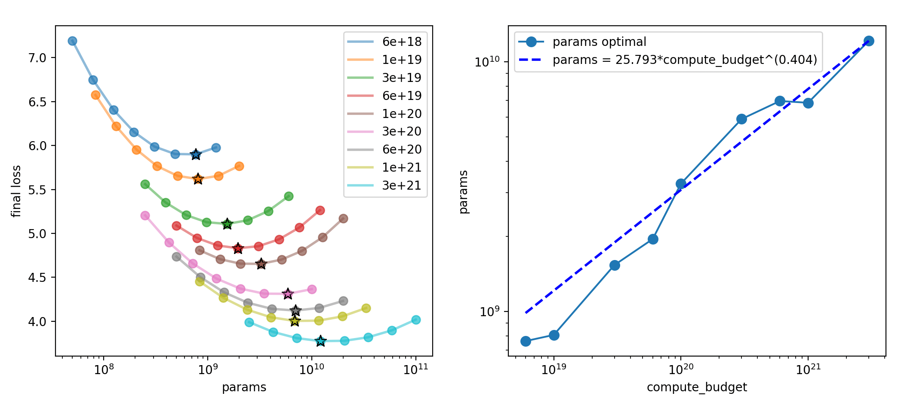
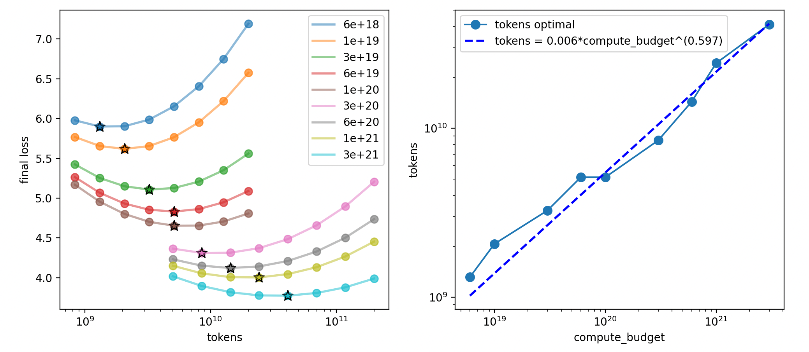

# CS336 Assignment 3 (scaling): Scaling Laws
[TOC]

## 2 Scaling Laws Review

### Problem (chinchilla_isoflops): 5 points

Write a script to reproduce the IsoFLOPs method describe above for fitting scaling laws using the final training loss from a set of training runs. For this problem, use the (synthetic) data from training runs given in the file data/isoflops_curves.json. This file contains a JSON array, where each element is an object describing a training run. Here are the first two runs for illustrating the format:

For fitting the scaling laws, the scipy package (and scipy.optimize.curve_fit in particular) might be useful, but you’re welcome to use any curve fitting method you’d like. While Hoffmann et al. [2022] fits a quadratic function to each IsoFLOP profile to find its minimum, we instead recommend you simply take the run with the lowest training loss for each compute budget as the minimum.

1. Show your extrapolated compute-optimal model size, together with the ⟨ $C_i , N_{opt}(C_i)$ ⟩ points you obtained. What is your predicted optimal model size for a budget of $10^{23}$ FLOPs? What about for $10^{24}$ FLOPs?

**Deliverable:** A plot showing your scaling law for model size by compute budget, showing the data points used to fit the scaling law and extrapolating up to at least $10^{24}$ FLOPs. Then, a one-sentence response with your predicted optimal model size.

2. Show your extrapolated compute-optimal dataset size, together with the ⟨ $C_i , D_{opt}(C_i)$ ⟩ data points from the training runs. What is your predicted optimal dataset size for budgets of $10^{23}$  and $10^{24}$ FLOPs?

**Deliverable:** A plot showing your scaling law for dataset size by compute budget, showing the data points used to fit the scaling law and extrapolating up to at least 10 24 FLOPs. Then, a one-sentence response with your predicted optimal dataset size.

## 3 Constructing Scaling Laws

### Problem (scaling_laws): 50 points

pass, need unavailable API.